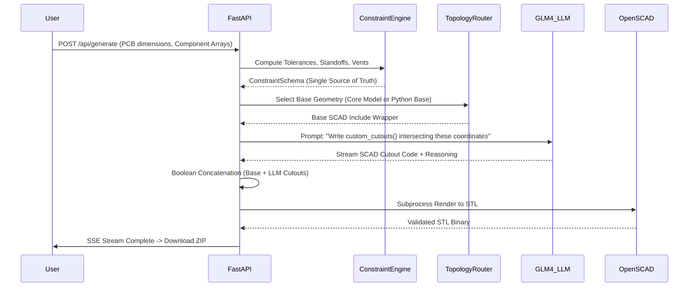
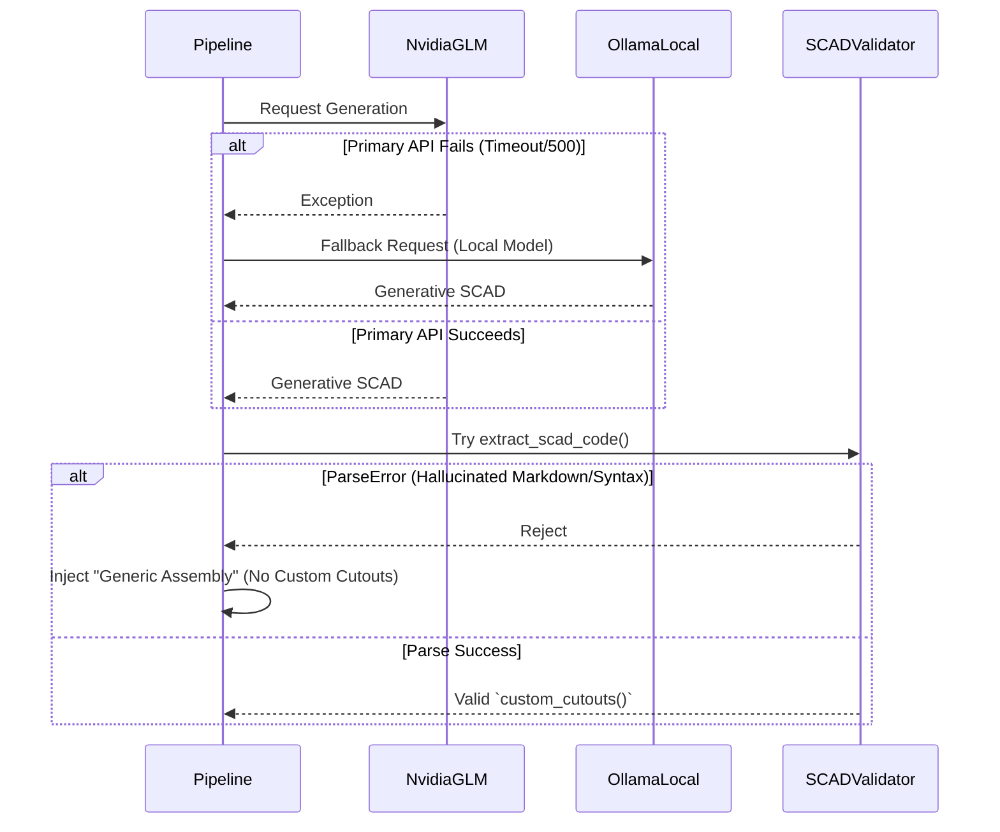

# EnclosureAI: Autonomous DFM-Compliant PCB Enclosure Generation

**An Autonomous, AI-Powered PCB Enclosure Generation System**

EnclosureAI bridges the gap between PCB design and mechanical engineering. It takes simple PCB dimensions, component coordinates, and thermal data, and autonomously generates thermally-aware, DFM-compliant, 3D-printable OpenSCAD and STL files in under 30 seconds.

---

## 1. The Problem: Flaws in Pure-LLM CAD Generation

In early architectural experiments of this system, Large Language Models (LLMs) were tasked with generating the complete 3D geometry of enclosures via zero-shot prompting. This approach exposed several critical flaws:

1.  **Spatial Hallucination & Non-Manifold Geometry:** LLMs possess no inherent spatial reasoning. Attempting to have an LLM compute wall thickness subtractions (`cube([x-2*wall, y-2*wall, z])`) often resulted in inverted faces, non-manifold geometry, or misaligned standoffs floating in mid-air.
2.  **The "Generic Box" Syndrome:** The LLM consistently collapsed into a localized minimum of generating featureless rectangular prisms, failing to account for diverse topologies like Wearable enclosures (requiring Minkowski sums for edge rounding) or Chimney cases (requiring complex convective draft stacks).
3.  **Fragile External Dependencies:** Prompting the LLM to use external libraries (e.g., BOSL2) proved highly fragile due to varying documentation versions in the LLM's training data, leading to unresolved function calls.
4.  **Tolerance Failures:** LLMs failed to properly account for FDM 3D printing tolerances (typically 0.2mm to 0.4mm clearance needed for interlocking parts).

---

## 2. The Solution: Hybrid Core Inclusion Architecture

To eliminate hallucination and ensure deterministic structural integrity, EnclosureAI implements a **Hybrid Procedural + LLM Architecture**. The system enforces a strict boundary between *structural engineering* and *aesthetic/functional detailing*.

### Phase A: Procedural Base Geometry (Deterministic Layer)
The Python backend completely assumes control over structural math.
-   **Core SCAD Inclusion for Standard Boards:** For standard development boards (ESP32 DevKit V1, Arduino Uno R3, Raspberry Pi 4), the backend holds highly accurate, zero-dependency, parameterized `.scad` files. These files contain mathematically exact standoff placements (e.g., `[14.0, 2.54]` offset for Arduino Uno).
-   **Procedural Python Generation:** For custom PCB sizes, the `TopologyRouter` mathematically constructs the base shell, lid, mounting standoffs, and thermal vent slots. The LLM does not generate this.

### Phase B: The LLM as a "Detailer" (Generative Layer)
The LLM receives the procedurally generated structural wrapper via an OpenSCAD `use <core_models/...>` directive. Its *only* responsibility is to parse the specific X/Y/Z coordinates of the user's USB ports, buttons, and displays, and write a `custom_cutouts()` module.

The validation pipeline seamlessly concatenates the strict procedural base with the LLM's generative cutout module using a boolean `difference()` operation:
```openscad
use <core_models/arduino_uno_r3.scad>

// Deterministic wrapper generated by FastAPI
outer_w = 60.4; outer_d = 78.6; outer_h = 22.0; wall = 2.0;

// LLM strictly generates this:
module custom_cutouts() {
    // USB-B Port Hole penetrating the Back Face
    translate([10, outer_d - wall - 0.1, 5]) cube([12, wall + 0.2, 11]);
}

// Final Assembly
difference() {
    arduino_uno_enclosure_body(outer_w, outer_d, outer_h, wall);
    custom_cutouts(); 
}
```

---

## 3. Technology Stack & Advanced Math Engines

### Core Backend (FastAPI, Python 3.11+)
*   **Constraint Engine:** Implements complex algorithms. For thermal modeling, it uses Newton's Law of Cooling approximations to compute the exact mm² of ventilation area required based on the user's provided wattage.
*   **DFM Validator:** A programmatic ruleset that audits the generated constraints prior to LLM processing. It enforces minimum wall thicknesses based on Print Material (e.g., PETG needs 1.2mm minimum, SLA can handle 0.8mm) and verifies printability angles.
*   **LLM Interface:** Asynchronous OpenAI SDK wrapping **NVIDIA GLM 4.7**. It parses delta streams in real-time, separating the `/* === ENCLOSUREAI DESIGN REASONING === ... */` comment blocks from the raw OpenSCAD syntax to stream live updates to the frontend via Server-Sent Events (SSE).

### Geometry Compilation Engine (OpenSCAD CLI)
*   The backend spawns asynchronous subprocesses to invoke the OpenSCAD binary.
*   It executes headlessly with `openscad --export-format binstl -o output.stl input.scad`.
*   A strict 30-second `asyncio.wait_for` timeout ensures infinite loops or excessive CSG (Constructive Solid Geometry) complexity won't hang the worker thread.

---

## 4. System Workflows & Mermaid Diagrams

### 4.1. Core Generation Pipeline
This diagram illustrates the separation of concerns and the strict validation loop.



### 4.2. Failover & Resilience Mechanism
The system implements an automated failover if the primary NVIDIA GLM API times out or hallucinates invalid SCAD syntax.



---

## 5. File Structure and Code Flow

The backend employs a modular, domain-driven design. Deterministic math logic is strictly isolated from generative LLM interfaces.

```text
enclosureai/backend/
├── app/
│   ├── core/
│   │   ├── constraint_engine.py    # Deterministic math: Newton's cooling, tolerance addition
│   │   ├── topology_router.py      # Factory mapping preset strings to underlying CAD files
│   │   └── topology_generators.py  # Procedural fallbacks for custom dimensional bases
│   │
│   ├── llm/
│   │   ├── interface.py            # Async LLM Factory implementing the Fallback Middleware
│   │   ├── glm_client.py           # Primary Client: integrate.api.nvidia.com
│   │   ├── ollama_client.py        # Fallback Client: Localhost port 11434
│   │   ├── strategy_aware_prompt.py# Compiles the strict system prompt locking down the LLM
│   │   └── few_shot_library.py     # Golden master examples of proper boolean subtration syntax
│   │
│   ├── scad/
│   │   ├── validator.py            # THE MAIN ORCHESTRATOR: Assembles SCAD strings and manages SSE
│   │   ├── core_models/            # Zero-dependency, static base CAD libraries
│   │   │   ├── esp32_devkit_v1.scad
│   │   │   ├── arduino_uno_r3.scad
│   │   │   ├── raspberry_pi_4.scad
│   │   │   └── generic_rectangular.scad
│   │   └── renderer.py             # Asynchronous Subprocess wrapper for the OpenSCAD binary
│   │
│   └── schemas/
│       ├── input_schemas.py        # Pydantic models for strict frontend payload validation
│       └── constraint_schemas.py   # Internal frozen dataclasses passing computed geometry downstream
│
├── .env.example                    # Environment variable templates
└── requirements.txt                # Python dependencies
```

### The `ConstraintSchema` Singleton
The entire architecture revolves around the `app.schemas.constraint_schemas.ConstraintSchema`. Once `ConstraintEngine.compute()` receives the user's `EnclosureRequest`, it performs all calculations and freezes them into a `ConstraintSchema`. This schema becomes the **single source of truth**. 
The LLM prompt is injected with a JSON representation of this schema, completely eliminating the LLM's ability to "guess" dimensions, ensuring deterministic, reproducible outputs.

---

## 6. Setup & Execution

### Environment Setup
Create a `.env` file in the `backend/` directory:
```env
LLM_PROVIDER=glm_fallback
NVIDIA_API_KEY=nvapi-your-key-here
OLLAMA_BASE_URL=http://localhost:11434
OPENSCAD_CLI_PATH=openscad
```

### Running the System
**Option A: Docker (Recommended)**
```bash
docker-compose up --build
```
Access the frontend at `http://localhost:5173` and the backend API at `http://localhost:8000`.

**Option B: Manual Development**
Ensure the OpenSCAD CLI is installed and globally available in your system `$PATH`.

```bash
# Terminal 1: Backend
cd backend
pip install -r requirements.txt
uvicorn app.main:app --reload --port 8000

# Terminal 2: Frontend
cd frontend
npm install
npm run dev
```
